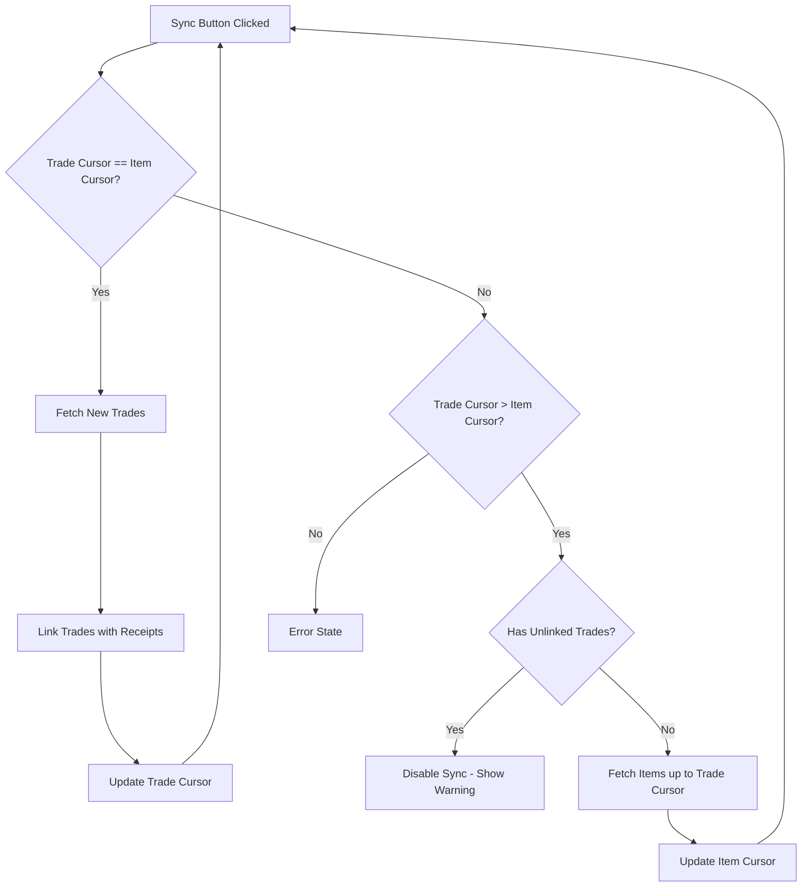

# Dual Cursor Implementation Plan for Auto-Pilot

## Overview
Reimplement cursors in Auto-Pilot (/auto page) to use two separate cursors instead of one:
- **Trade Cursor**: Tracks last fetched trade timestamp
- **Item Cursor**: Tracks last fetched item transaction (logs) timestamp

## Architecture



## Implementation Steps

### 1. Create DualCursor Type (lib/cursor.ts)
Add a new interface to track both cursors:
```typescript
export interface DualCursor {
  tradeCursor: SyncCursor;
  itemCursor: SyncCursor;
}
```

### 2. Update JournalConfig Interface (store/useJournal.ts)
- Replace `autoPilotCursor` with `autoPilotTradeCursor` and `autoPilotItemCursor`
- Add both to config persistence
- Add migration logic for legacy single cursor

### 3. Update useJournal State (store/useJournal.ts)
- Add `autoPilotTradeCursor` state variable
- Add `autoPilotItemCursor` state variable
- Update `applyConfig` function
- Update `buildConfigSnapshot` function
- Update `saveAutoPilotState` function

### 4. Modify Sync Logic (app/auto/page.tsx)

**Initialization:**
- Initialize both cursors to the same timestamp on first run

**Sync Logic:**
```
IF there are unlinked trades in cache:
  - Disable sync with warning message
  - Show which trades need review
ELSE:
  - IF Trade Cursor timestamp == Item Cursor timestamp:
    - Fetch new trades from Trade Cursor timestamp
    - Link trades with receipts
    - Update Trade Cursor to latest trade timestamp
    - (Item Cursor stays unchanged since items were already fetched)

  - IF Trade Cursor timestamp > Item Cursor timestamp:
    - Fetch item logs up to Trade Cursor timestamp
    - Update Item Cursor to Trade Cursor timestamp
    - Then proceed with trade fetching
```

### 5. Update UI (app/auto/page.tsx)
- Display both cursors with labels
- Show sync status indicating what will be fetched
- Disable sync button when:
  - there are unlinked trades in cache
  - Already syncing
  - Has pending trades

### 6. Legacy Migration
- On load, if only `autoPilotCursor` exists, migrate to dual cursor:
  - Set both `tradeCursor` and `itemCursor` to the existing cursor values

## Files to Modify

1. **lib/cursor.ts** - Add DualCursor type
2. **store/useJournal.ts** - Add new state variables and update persistence
3. **app/auto/page.tsx** - Implement dual cursor sync logic and UI

## Key Behavior Details

### When Trade Cursor == Item Cursor (Normal Sync)
1. User clicks Sync
2. Fetch trades from `tradeCursor.lastTimestamp`
3. Link with receipts, handle discrepancies
4. Update `tradeCursor` to latest trade timestamp
5. Item cursor remains unchanged (items already synced up to this point)

### When Trade Cursor > Item Cursor (Items Behind)
1. User clicks Sync
2. Detect `tradeCursor.lastTimestamp > itemCursor.lastTimestamp`
3. Check for unlinked trades in cache:
   - **If no unlinked trades**: Fetch item logs up to `tradeCursor.lastTimestamp`
4. Update `itemCursor` to `tradeCursor.lastTimestamp`

### First Initialization
- Set both cursors to current timestamp
- User sees "Initialize Auto-Pilot" button initially
- After first sync, shows "Sync Now" with both cursor values displayed
